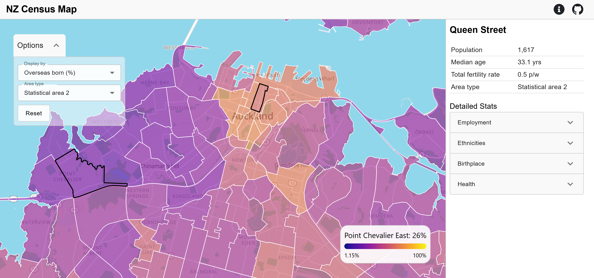

# NZ Census Map

A simple website to visualise the 2023 NZ Census using an interactive map

## General info
* This project is composed of two sub-repos `nz-census-map-backend` and `nz-census-map-frontend`, see these repositories for the frontend and backend code respectively.
* Credits:
    * Census and map data from [Stats NZ](https://www.stats.govt.nz/)
    * NZ basemap from [Protomaps](https://docs.protomaps.com/basemaps/downloads) 
    * Maps visualised using [MapLibre](https://maplibre.org/maplibre-gl-js/docs/)